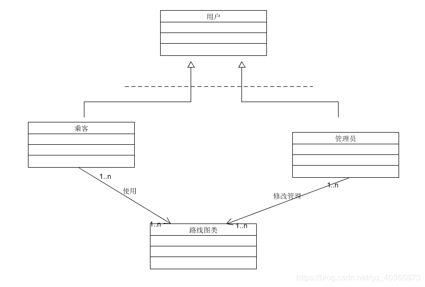

# 地铁线路查询程序
软件工程课程设计 [代码仓库地址](https://github.com/CTmH/metro-planning)

# 项目日志
[项目第1周日志](https://ctmh.github.io/Blogs/Week1Log)

[项目第2周日志](https://ctmh.github.io/Blogs/Week2Log)

[项目第3周日志](https://ctmh.github.io/Blogs/Week3Log)

[项目第4周日志](https://ctmh.github.io/Blogs/Week4Log)

# 开发时间预估和实际开发时间
 |psp2.1| Personal Software Pricess Stages| 预估耗时（分钟）|实际耗时（分钟）
|--|:-|--|--|
|Planning|  计划|  30 | 40  |
|Estimate| 估计这个任务需要多少时间|  20  |  10  |
|Development|开发|  1200  |  1500  |
|Analysis| 需求分析（包括学习新技术）|  60  |  120  |
|Design Review|	生成设计文档|  120 |  60 |
|Coding Standard	|代码规范（为目前的开发指定合适的规范）| 60  | 45  |
|Design	|具体设计|  240 |  200 |
|Coding	|具体编码| 1500  |  1800 |
|Code Review	|代码复审| 120 | 100  |
|Test	|测试（自我测试，修改代码，提交修改）| 240  | 300  |
|Reporting	|报告|  120 | 180  |
|Test Report	|测试报告|  90 |  45 |
|Size Measurement	|计算工作量| 40  |  30  |
|Postmortem & Process Improvement Plan	|事后总结，并提出修改过程计划	|  40  |  20  |   
|   |  合计| 3880|  4450 |

# 面向对象分析
## 用例图
**用例图综述：**“地铁线路查询系统”通过乘客和系统管理员共同完成系统功能。管理员负责录入和修改站点信息；乘客通过系统交互选择查询的城市以及是否考虑换乘，查询线路信息、查询两站点之间最有效线路、查询最快遍历路线，系统通过数据文件和相关算法查找，返回乘客所需的线路信息。

参与者：乘客，管理员，同时抽象出“用户“。实现用户方法的重用，增加系统的灵活性。

1. 用例名称：查询地铁线路
基本事件流：乘客输入要查询的地铁线路号，系统从数据文件中查找所需的线路的站点信息并显示。

扩展事件流：无

关系描述：查询地铁线路包含了“录入和修改信息“用例，需要录入和修改信息的支持

前置条件：乘客输入需要查询的站点信息

后置条件：无

异常：无

限制：乘客要查询的地铁线路号必须在已有的线路范围内

2. 用例名称：查询两站点最短路

基本事件流：乘客输入两个要查询的地铁站点，系统查找并计算出时间最短的线路

扩展事件流：无

关系描述：查询两站点最短路包含了“录入和修改信息“用例，需要录入和修改信息的支持

前置条件：乘客输入需要查询的两个站点

后置条件：无

异常：无

限制：乘客要查询的两个站点必须在已有的站点内

3. 用例名称：查询最快遍历路线

基本事件流：乘客输入起始的地铁站点，系统查找并计算出时间最短的遍历线路

扩展事件流：无

关系描述：查询最快遍历路线包含了“录入和修改信息“用例，需要录入和修改信息的支持

前置条件：乘客输入起始的站点

后置条件：无

异常：无

限制：乘客要查询的站点必须在已有的站点内

4. 用例名称：录入和修改信息
基本事件流：管理员把新建的地铁站加入到原有的地铁系统中

扩展事件流：无

前置条件：管理员输入需要修改或新建的地铁信息

后置条件：无

异常：无

限制：无

## 包图：

包图描述文档：
- 包图综述：该图描述了系统中所包含的初步类的包图，包括路线规划和用户接口界面UI以及包间关系。路线规划包和UI包有依赖关系，包括对路线和站点的导入导出关联。
- 包的名称：UI包，路线规划包
- 包的种类：类包
- 包图中模型元素所在文档：在实践过程中，给出包图中所描述的模型元素所在文档和位置
- 其他描述：无

## 类图

类的属性和服务的定义：

|类	|属性	|服务
|--|:-|--|
|用户	|权限	|登录
|乘客	|-	|查询
|管理员	|ID，姓名，密码	|登录，查询，修改|
|路线图	|站点、路线	|查询路线，找最佳路线，查询遍历的路径及时间|

类图描述文档：
· 类图综述：类图描述了“地铁线路查询系统“中所包含的初步的类及其类间关系。类的识别过程：在地铁线路查询系统中，乘客要通过系统查询地铁站点和规划线路，系统管理员要对线路图进行维护。可以识别出乘客类、管理员类和路线图类，其中乘客类和管理员类可以抽象出“用户类”。在类间关系识别中可以看出用户与乘客和管理员之间是泛化关系，乘客和路线图是关联关系，管理员和路线图是关联关系。
· 类描述：见表格
· 关联描述：“乘客”和“路线图”之间、“管理员”和“路线图”之间是限定关联，关联的重数见类图。泛化描述：“乘客”和“管理员”与“用户”是受限泛化关系。用户下不只有乘客和管理员。

## 地铁线路查询系统顺序图

- 顺序图综述：该顺序图描述了“查找路线命令”，“查找两路线最有效线路”，”查找遍历最快方法“。涉及乘客，路线系统，数据文件三个对象。
- 参与者对象描述：“乘客“是参与者，”路线系统“和”数据文件“是对象。路线系统通过获取数据文件信息，接收乘客请求，实现查询的逻辑操作。”数据文件“存放站点和路线相关信息，用于给路线系统提供相关数据。
- 消息描述：在开始阶段，路线系统通过读取数据文件消息，获取站点和路线信息。乘客提交需要查询的路线信息和路线命令，路线系统根据命令和信息搜索，最后将站点信息返回给乘客。

## 地铁线路查询系统活动图

- 活动图综述：描述了用户查询所需信息的活动图，涉及用户、查询系统、地图3个对象，他们共同完成查询活动。
- 参与者对象描述：“用户“是参与者，”查询系统“和”地图“是对象。用户提供城市选择、查询信息和查询功能选择。查询负责查询和输出查询结果。”地图“存放站点和路线相关信息，用于给路线系统提供相关数据。
- 状态描述：用户发送“城市选择”后，系统“读取地图”获得相应的地图文件，接收乘客“查询选择”和“查询内容”，实现相应的查询操作并“显示结果”。
- 转换描述：读取信息后有两个分支，一个获得查询方式选择，另一个获得查询内容，之后根据查询方式进入相应的查询分支。

## 地铁线路查询系统状态图

- 状态图综述：描述了查询功能中查询系统的状态变化
- 状态描述：“城市选择”状态下等待用户选择查询城市，“线路图读取”状态下读取所选城市站点线路信息，”查询功能选择“状态等待用户选择查询功能，”输入线路号获取“”起点终点站点信息获取“”遍历起点获取“分别表示等待用户输入查询条件（信息）的状态，”站点查询“”路线查询“”遍历线路查询“分别表示执行查询命令的状态，”站点输出“”路线输出“”遍历线路输出“分别表示查询信息展示状态
- 状态转换描述：”城市“条件触发转换到线路图读取状态，“查询线路”“查询最短路径”“查询最短遍历”条件分别触发不同查询模式选择，进入到不同的查询信息获取状态，若有“错误的路线号”“错误的站点”等条件，则转换到错误，“退出”条件则使得查询功能选择状态转移到结束状态

## 地铁线路查询系统协作图

- 协作图综述：描述了地图查询的协作图，涉及用户、查询系统、地图文件3个对象
参与者对象描述：用户是参与者，查询系统、地图是对象。查询系统负责根据用户输入的查询类型和查询条件返回查询结果，地图文件负责向查询系统提供站点信息。
- 消息描述：用户发送查询类型和查询条件后查询系统响应，地图文件将站点信息提供给查询系统查询，查询系统最后将查询结果返回给用户
