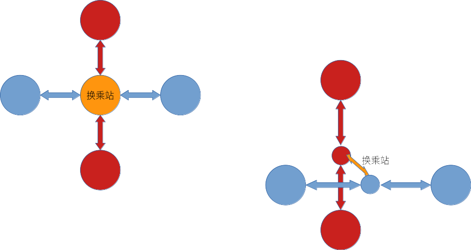

# 主要活动

本周主要完成项目核心类的设计和实现工作。

1. 定义了软件的核心类——查询系统类
2. 定义了查询系统类所需的相关数据结构：站点表 查询图站点表 站点图 等
3. 设计了站点查询的核心算法和相应数据结构
4. 配置Boost库
5. 代码实现了站点最短路查询函数

# 问题解决

## 如何解决换乘额外代价问题

决定采用拆分站点的方法。将换乘站在查询图中存储为两个结点，两个结点各自连接两条换乘线路的相邻结点，这两个结点之间连接一条边，其权值为换乘的代价。

示意图如下：



通过站点表和查询图站点表将被拆分处理后的结点和站点重新对应，输出时去掉遍历中相邻的重复结点就可以了。

## 如何获取路线图数据

通过读取txt中文本信息来构建线路图。
在数据结构设计上，不存储各线路信息，只存储站点信息。

## 图的数据结构

定义SearchSys作为系统类，在SearchSys中定义有MetroGraph类型的图，是boost支持的邻接表。
第三次结对：

## 换乘站标示
isTransfer数据类型采用int还是bool：int可以记录换乘站包含的线路数量；bool可以使代码更加易读，而线路数量可以采用vector的size方法直接调用查看。最终选择isTransfer采用bool形式处理。

## graph_station包含内容
对sysid到id的映射处理方法产生分歧：队友认为从sysid到id可以直接使用map或者使用以数组下标为索引的数组保存即可，将Station中对属于不同路线的同一站点使用vector<Sstation> TransferID保存；
  
我认为sysid到id使用Sstation结构体组成的vector查找，在读取地图信息同时建立该变长数组，优点是系统查找结束返回站点的时候不必再从Station里双循环遍历查找，可以节省时间。最终选择折衷的办法，同时建立vector<Sstation> TransferID和vector<Sstation> graph_station_list。
  
## 最短路径查询
```cpp
//通过继承和重写visitor来获得最小生成树
template <class PredecessorMap>
class record_predecessors : public dijkstra_visitor<>
{
public:
  record_predecessors(const PredecessorMap& p)
    : m_predecessor(p) { }
  //每当一条边松弛后会调用下面的函数
  template <class Edge, class Graph>
  void edge_relaxed(Edge e, Graph& g) {
    // set the parent of the target(e) to source(e)
    put(m_predecessor, target(e, g), source(e, g));
  }
}
```
visitor类型的模版含有很多虚函数，这些函数会在相应的算法函数进行到某一步时被调用，edge_relaxed每当一条边松弛后会被调用，因此重写这一函数即可存储最小生成树

```cpp
dijkstra_shortest_paths(mtgph, s, distance_map(&d[0]).visitor(make_predecessor_recorder(&p[0])));
```
将p的内容取出就是最小生成树，然后便可获得路径
